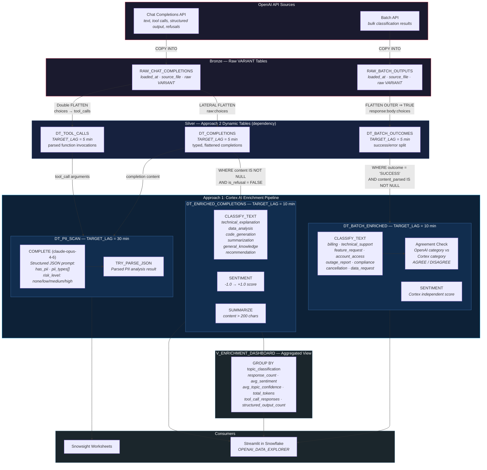
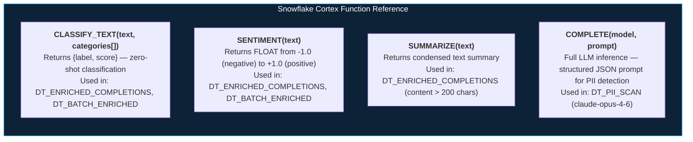

# Operational Flow - Approach 1: Cortex AI Enrichment

Author: SE Community
Last Updated: 2026-02-26
Expires: 2026-03-28
Status: Reference Implementation

Reference Implementation: Review and customize for your requirements.

## Overview

The headline feature. Snowflake Cortex functions classify, score sentiment, summarize, and scan
for PII in OpenAI outputs — analyzing AI with AI, entirely within Snowflake. No external API calls,
no data movement outside your account boundary. This approach depends on Approach 2's Silver
dynamic tables as its source.

## Operational Flow

## Cortex Functions Used

## Component Descriptions

| Object | Type | Source | Cortex Functions | Purpose |
|--------|------|--------|-----------------|---------|
| `DT_ENRICHED_COMPLETIONS` | Dynamic Table (10 min lag) | `DT_COMPLETIONS` | CLASSIFY_TEXT, SENTIMENT, SUMMARIZE | Topic classification, sentiment scoring, content summarization |
| `DT_BATCH_ENRICHED` | Dynamic Table (10 min lag) | `DT_BATCH_OUTCOMES` | CLASSIFY_TEXT, SENTIMENT | QA OpenAI's classification against Cortex — agreement tracking |
| `DT_PII_SCAN` | Dynamic Table (30 min lag) | `DT_COMPLETIONS`, `DT_TOOL_CALLS` | COMPLETE (claude-opus-4-6) | PII detection with structured JSON analysis output |
| `V_ENRICHMENT_DASHBOARD` | View | `DT_ENRICHED_COMPLETIONS` | — | Aggregated metrics by topic for Streamlit dashboard |

## Trade-offs

| Strength | Trade-off |
|----------|-----------|
| Native AI — no external API calls | Cortex credit consumption per function call |
| QA one AI's output with another | Region/model availability for Cortex functions |
| PII detection built in | Latency per enrichment call (mitigated by TARGET_LAG) |
| Fully governed within Snowflake | Depends on Approach 2 Silver tables |
