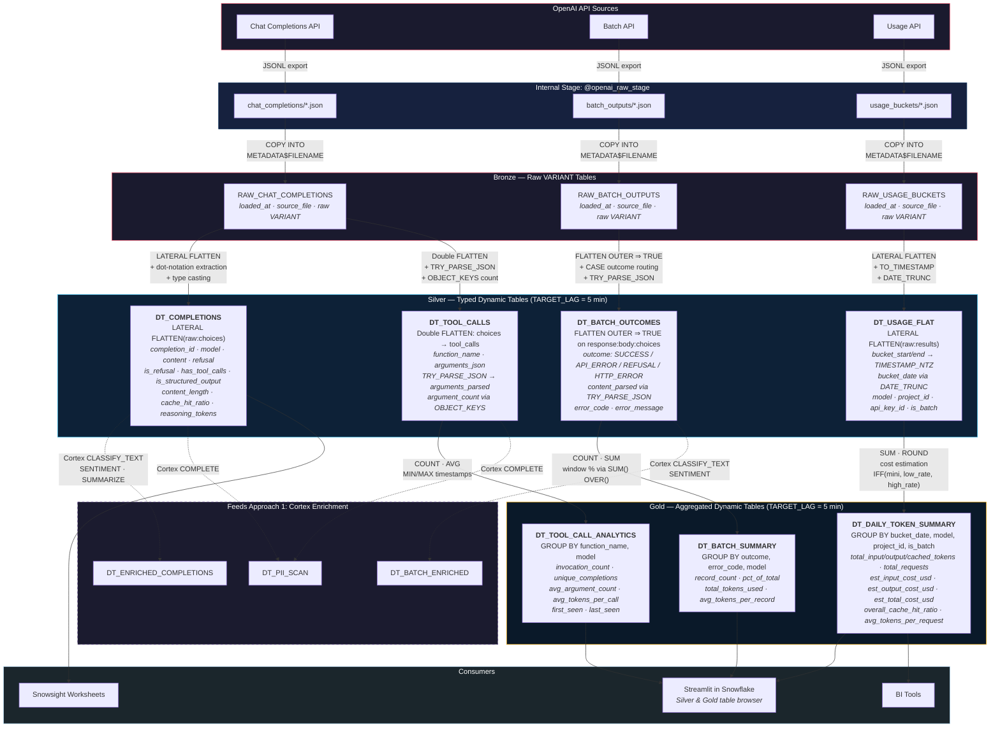
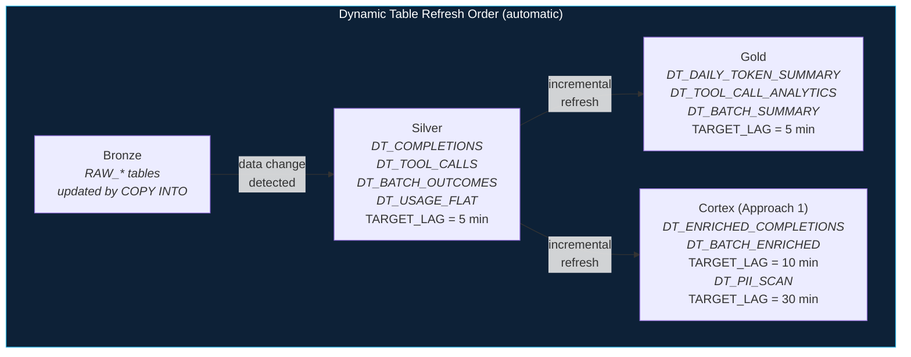

# Operational Flow - Approach 2: Medallion Architecture

Author: SE Community
Last Updated: 2026-02-26
Expires: 2026-03-28
Status: Reference Implementation

Reference Implementation: Review and customize for your requirements.

## Overview

Declarative Bronze → Silver → Gold pipeline using Dynamic Tables with automatic incremental refresh.
No orchestrator required — Snowflake handles dependency resolution and refresh scheduling via
TARGET_LAG. Silver tables extract and type-cast from raw VARIANT; Gold tables aggregate for
analytics. This layer also serves as the foundation for Approach 1 (Cortex AI Enrichment).

## Operational Flow

## Refresh Dependency Chain

## Component Descriptions

| Object | Layer | Source | TARGET_LAG | Purpose |
|--------|-------|--------|------------|---------|
| `DT_COMPLETIONS` | Silver | `RAW_CHAT_COMPLETIONS` | 5 min | Typed, flattened completions — content, refusal, tool call flags, cache ratio |
| `DT_TOOL_CALLS` | Silver | `RAW_CHAT_COMPLETIONS` | 5 min | One row per tool invocation — parsed arguments, argument count |
| `DT_BATCH_OUTCOMES` | Silver | `RAW_BATCH_OUTPUTS` | 5 min | Success/error/refusal routing — parsed content, error metadata |
| `DT_USAGE_FLAT` | Silver | `RAW_USAGE_BUCKETS` | 5 min | Flattened usage records — timestamps, model/project/key dimensions |
| `DT_DAILY_TOKEN_SUMMARY` | Gold | `DT_USAGE_FLAT` | 5 min | Daily cost estimation — input/output/cached tokens, USD estimates |
| `DT_TOOL_CALL_ANALYTICS` | Gold | `DT_TOOL_CALLS` | 5 min | Function frequency and argument patterns — invocation counts, avg tokens |
| `DT_BATCH_SUMMARY` | Gold | `DT_BATCH_OUTCOMES` | 5 min | Batch health — outcome distribution, error rates, token efficiency |

## Trade-offs

| Strength | Trade-off |
|----------|-----------|
| Pre-computed, fast reads | Additional storage for materialized data |
| Automatic refresh via TARGET_LAG | Warehouse must be available for refresh |
| Clear dependency chain — no orchestrator | Slight data latency (configurable per table) |
| Foundation for Cortex enrichment | Silver refresh must complete before Gold/Cortex |
