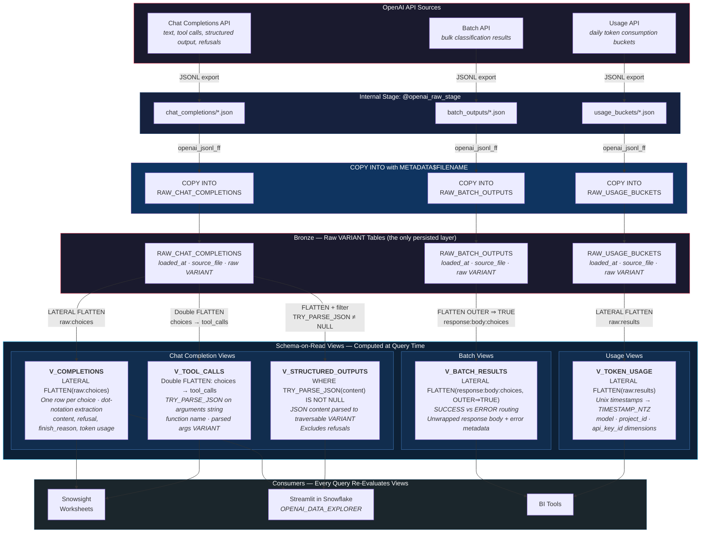
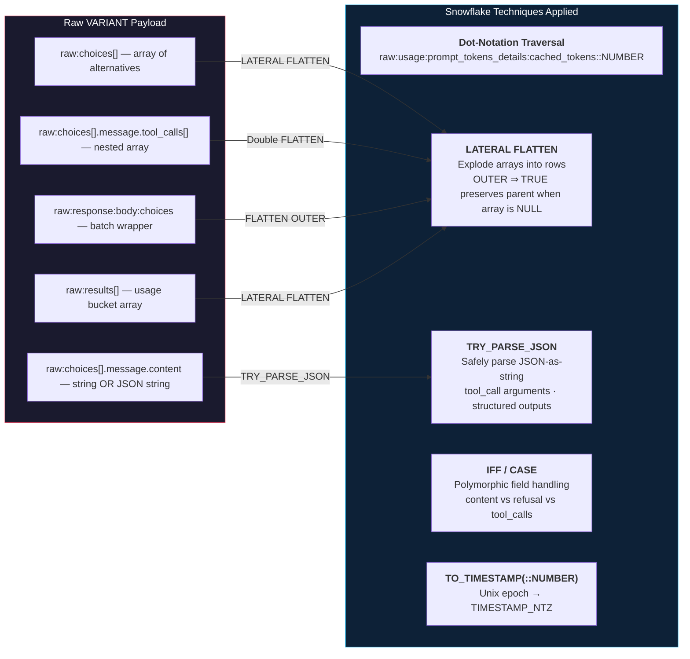

# Operational Flow - Approach 3: Schema-on-Read

Author: SE Community
Last Updated: 2026-02-26
Expires: 2026-03-28
Status: Reference Implementation

Reference Implementation: Review and customize for your requirements.

## Overview

Schema-on-Read keeps raw VARIANT data intact and creates views that flatten and type-cast on demand.
Every query re-evaluates the FLATTEN logic against the current raw data — zero ETL lag, full schema
evolution tolerance, but compute cost on every read. The simplest approach to deploy and the most
flexible when OpenAI's response schema changes.

## Operational Flow

## Query-Time Transformation Detail

## Component Descriptions

| Object | Type | Source | Purpose |
|--------|------|--------|---------|
| `V_COMPLETIONS` | View | `RAW_CHAT_COMPLETIONS` | One row per choice — text content, refusals, token usage, model metadata |
| `V_TOOL_CALLS` | View | `RAW_CHAT_COMPLETIONS` | One row per tool invocation — function name, parsed JSON arguments |
| `V_STRUCTURED_OUTPUTS` | View | `RAW_CHAT_COMPLETIONS` | JSON content parsed to traversable VARIANT (excludes refusals) |
| `V_BATCH_RESULTS` | View | `RAW_BATCH_OUTPUTS` | Unwrapped batch responses — SUCCESS/ERROR split, content + error metadata |
| `V_TOKEN_USAGE` | View | `RAW_USAGE_BUCKETS` | Flattened usage buckets — time-series ready with model/project/key dimensions |

## Trade-offs

| Strength | Trade-off |
|----------|-----------|
| Zero ETL lag — always current | Warehouse compute on every read |
| Schema evolution tolerant — new fields appear automatically | Complex view definitions to maintain |
| No storage duplication — only raw data persisted | No pre-computed aggregations |
| Simplest to deploy and modify | Repeated FLATTEN cost for frequent queries |
| No refresh scheduling or warehouse dependency | Cannot serve as source for Cortex enrichment |
