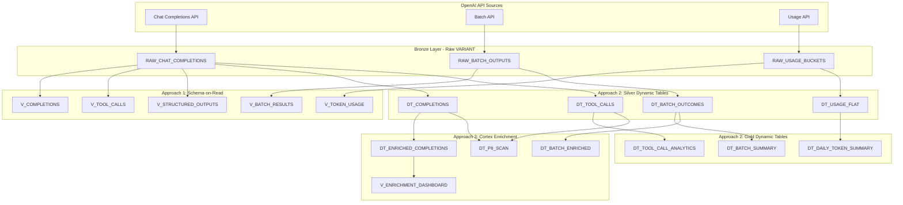

# Data Flow Diagram

```mermaid
flowchart TB
    subgraph sources [OpenAI API Sources]
        ChatAPI["Chat Completions API"]
        BatchAPI["Batch API"]
        UsageAPI["Usage API"]
    end

    subgraph bronze [Bronze Layer - Raw VARIANT]
        RAW_CC["RAW_CHAT_COMPLETIONS"]
        RAW_BO["RAW_BATCH_OUTPUTS"]
        RAW_UB["RAW_USAGE_BUCKETS"]
    end

    ChatAPI --> RAW_CC
    BatchAPI --> RAW_BO
    UsageAPI --> RAW_UB

    subgraph approach1 [Approach 1: Schema-on-Read]
        V_COMP["V_COMPLETIONS"]
        V_TOOL["V_TOOL_CALLS"]
        V_STRUCT["V_STRUCTURED_OUTPUTS"]
        V_BATCH["V_BATCH_RESULTS"]
        V_USAGE["V_TOKEN_USAGE"]
    end

    RAW_CC --> V_COMP
    RAW_CC --> V_TOOL
    RAW_CC --> V_STRUCT
    RAW_BO --> V_BATCH
    RAW_UB --> V_USAGE

    subgraph approach2_silver [Approach 2: Silver Dynamic Tables]
        DT_COMP["DT_COMPLETIONS"]
        DT_TOOL["DT_TOOL_CALLS"]
        DT_BOUT["DT_BATCH_OUTCOMES"]
        DT_UFLAT["DT_USAGE_FLAT"]
    end

    RAW_CC --> DT_COMP
    RAW_CC --> DT_TOOL
    RAW_BO --> DT_BOUT
    RAW_UB --> DT_UFLAT

    subgraph approach2_gold [Approach 2: Gold Dynamic Tables]
        DT_DAILY["DT_DAILY_TOKEN_SUMMARY"]
        DT_TCA["DT_TOOL_CALL_ANALYTICS"]
        DT_BSUM["DT_BATCH_SUMMARY"]
    end

    DT_UFLAT --> DT_DAILY
    DT_TOOL --> DT_TCA
    DT_BOUT --> DT_BSUM

    subgraph approach3 [Approach 3: Cortex Enrichment]
        DT_ENRICH["DT_ENRICHED_COMPLETIONS"]
        DT_BENRICH["DT_BATCH_ENRICHED"]
        DT_PII["DT_PII_SCAN"]
        V_DASH["V_ENRICHMENT_DASHBOARD"]
    end

    DT_COMP --> DT_ENRICH
    DT_BOUT --> DT_BENRICH
    DT_COMP --> DT_PII
    DT_TOOL --> DT_PII
    DT_ENRICH --> V_DASH
```
