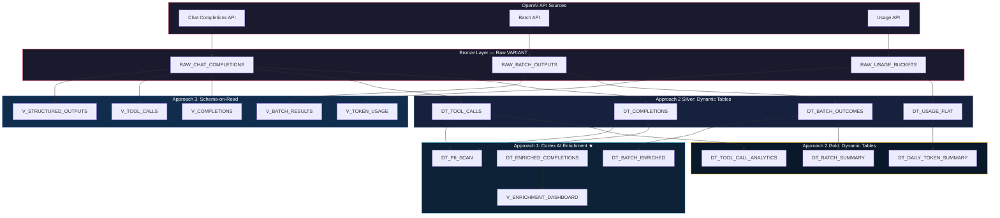

# Data Flow - OpenAI Data Engineering with Cortex AI

Author: SE Community
Last Updated: 2026-02-26
Expires: 2026-03-28
Status: Reference Implementation

Reference Implementation: Review and customize for your requirements.

## Overview

Three approaches for transforming complex OpenAI API responses in Snowflake. All three share the
same Bronze layer (raw VARIANT tables loaded from staged JSONL files). Each approach offers
different trade-offs for latency, compute cost, and analytical capability.

## High-Level Architecture

## Detailed Operational Flow Diagrams

Each approach has a dedicated operational flow diagram with full component detail:

| Approach | Diagram | Highlights |
|----------|---------|------------|
| **1. Cortex AI Enrichment** | [approach1-cortex-enrichment.md](approach1-cortex-enrichment.md) | CLASSIFY_TEXT, SENTIMENT, SUMMARIZE, COMPLETE for PII |
| **2. Medallion Architecture** | [approach2-medallion.md](approach2-medallion.md) | Bronze → Silver → Gold with TARGET_LAG refresh chain |
| **3. Schema-on-Read** | [approach3-schema-on-read.md](approach3-schema-on-read.md) | LATERAL FLATTEN + Views, zero ETL lag |
